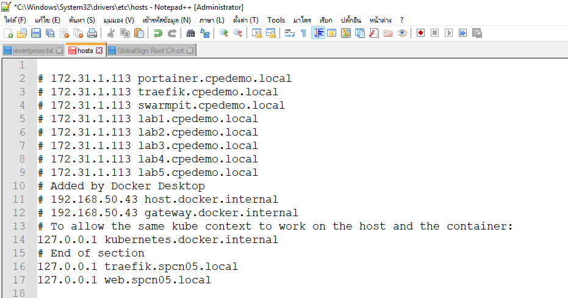
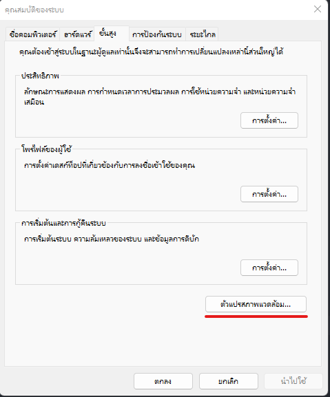
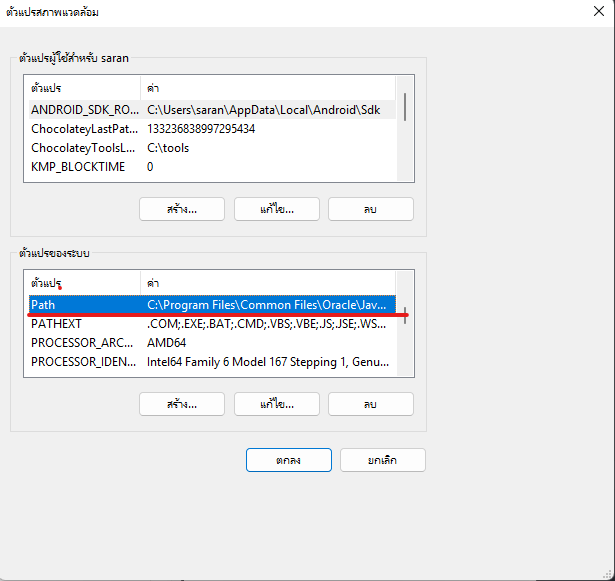
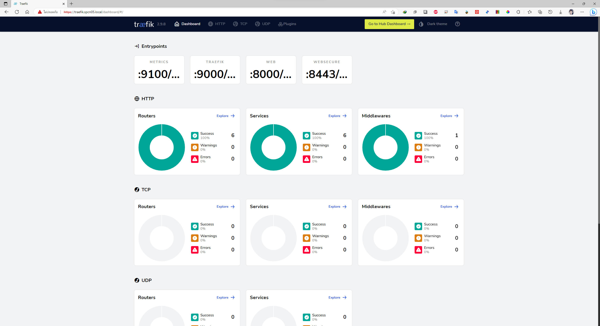
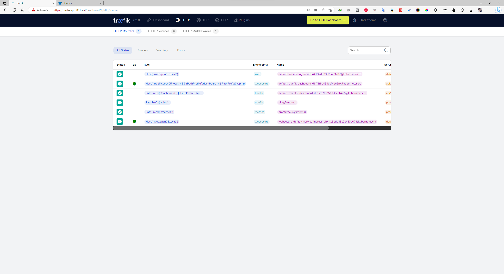

# Kubernetes

## Wakatime
- https://wakatime.com/@spcn05/projects/ezgjtswfdh

## Ref
- https://github.com/iamapinan/kubeplay-traefik

# แก้ไขไฟล์ host

1. เข้าไปยัง C:\Windows\System32\drivers\etc

2. แก้ไขไฟล์ host โดยเพิ่มบรรทัดด้านล่างลงไป
    
  ```
    127.0.0.1 traefik.spcn05.local
    127.0.0.1 web.spcn05.local
  ```

 

# ขั้นตอนการติดตั้ง kubectl

1. สร้างโฟลเดอร์ที่ C:\kubectl ขึ้นมา

2. ใช้คำสั่งด้านล่างที่โฟลเดอร์ C:\kubectl เพื่อดาวน์โหลด kubectl
    
  ```
    curl.exe -LO "https://dl.k8s.io/release/v1.26.0/bin/windows/amd64/kubectl.exe"
  ```
  
3. ทำการสร้าง path kubectl ขึ้นมา

 

 

 

4. ตรวจสอบเวอร์ชั่น kube เพื่อเช็คสถานะการติดตั้ง
    
  ```
    kubectl version --client
  ```

# ขั้นตอนการติดตั้ง Minikube

1. เข้าเว็บไซต์ https://minikube.sigs.k8s.io/docs/start/ เพื่อทำการดาวน์โหลดไฟล์ exe มาอันดับแรก

    

2. หลังดาวน์โหลดแล้วให้ชำคำสั่งด้านล่างนี้ ให้อยู่ภายในโฟลเดอร์เดียวกันกับไฟล์ exe

  ```
    $oldPath = [Environment]::GetEnvironmentVariable('Path', [EnvironmentVariableTarget]::Machine)
    if ($oldPath.Split(';') -inotcontains 'C:\minikube'){ `
    [Environment]::SetEnvironmentVariable('Path', $('{0};C:\minikube' -f $oldPath), [EnvironmentVariableTarget]::Machine) `
    }
  ```

3. ทำการเริ่ม service ด้วยคำสั่ง 
  ```
    minikube start
  ```

4. ใช้คำสั่งเพื่อทำการเปิดหน้า Dashboard
  ```
    minikube dashboard
  ```

# ขั้นตอนการติดตั้ง Traefik

1. ใช้คำสั่งติดตั้ง Traefik Resource Definitions

  ```
    kubectl apply -f https://raw.githubusercontent.com/traefik/traefik/v2.9/docs/content/reference/dynamic-configuration/kubernetes-crd-definition-v1.yml
  ```

2. ใช้คำสั่งติดตั้ง RBAC for Traefik

  ```
    kubectl apply -f https://raw.githubusercontent.com/traefik/traefik/v2.9/docs/content/reference/dynamic-configuration/kubernetes-crd-rbac.yml
  ```

3. ทำการสร้าง namespace

  ```
    kubectl create namespace <namespace>
  ```

4. ใช้คำสั่งติดตั้ง Traefik Helmchart

  ```
    helm repo add traefik https://traefik.github.io/charts
    helm repo update
    helm install traefik traefik/traefik
  ```

5. ตรวจสอบ Service Traefik

  ```
    kubectl get svc -l app.kubernetes.io/name=traefik
    kubectl get po -l app.kubernetes.io/name=traefik
  ```

6. ทำการสร้างรหัส Secret โดยทำการรันบน git bash โดย <user> คือ User ที่ใช้ล็อกอินใน Traefik

  ```
    htpasswd -nB <user> | tee auth-secret

    kubectl create secret generic -n default dashboard-auth-secret --from-file=users=auth-secret -o yaml --dry-run=client | tee dashboard-secret.yaml
  ```
    จะได้ไฟล์ที่ชื่อว่า dashboard-secret.yaml ขึ้นมา

7. นำรหัสคีย์จากไฟล์ dashboard-secret.yaml มาใส่ใน traefik-dashboard.yaml

8. ทำการ Deploy โดยใช้คำสั่ง

  ```
    kubectl apply -f traefik-dashboard.yaml
  ```

9. ใช้คำสั่งเปิด LoadBalance

  ```
    minikube tunnel
  ```

    

10. ทดสอบโดยการเข้าไปยังลิงค์ https://traefik.spcn05.local/dashboard/#/

    

    

# Rancher-hello-world deployment

1. ทำการสร้างไฟล์ rancher.yaml เพื่อเตรียมการ deploy

2. ใส่โค้ดด้านล่างนี้ลงไปในไฟล์ rancher.yaml 

  ```
    apiVersion: apps/v1
    kind: Deployment
    metadata:
    name: rancher-deployment
    namespace: default
    spec:
    replicas: 1
    selector:
        matchLabels:
        app: rancher
    template:
        metadata:
        labels:
            app: rancher
        spec:
        containers:
        - name: rancher
            image: rancher/hello-world
            ports:
            - containerPort: 80
    ---
    apiVersion: v1
    kind: Service
    metadata:
    name: rancher-service
    labels:
        name: rancher-service
    namespace: default
    spec:
    selector:
        app: rancher
    ports:
    - name: http
        port: 80
        protocol: TCP
        targetPort: 80
    ---
    apiVersion: traefik.containo.us/v1alpha1
    kind: IngressRoute
    metadata:
    name: service-ingress
    namespace: default
    spec:
    entryPoints:
        - web
        - websecure
    routes:
    - match: Host(`web.spcn05.local`)
        kind: Rule
        services:
        - name: rancher-service
        port: 80
  ```

3. ใช้คำสั่งเพื่อทำการ deploy

  ```
    kubectl apply -f rancher.yaml     
  ```

4. ทดสอบโดยการเข้าไปยังลิงค์ https://web.spcn05.local/

    

